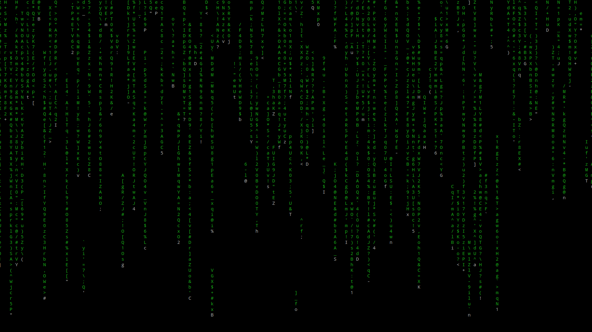

Matrix
===
Linux and Windows matrix terminal output.  
&nbsp;  
_Linux:_
```sh
$ chmod +x matrix.sh
$ ./matrix.sh
```
###### *matrix.sh output*

&nbsp;  
_Windows:_
```console
$ start matrix.bat
```
###### *matrix.bat output*
